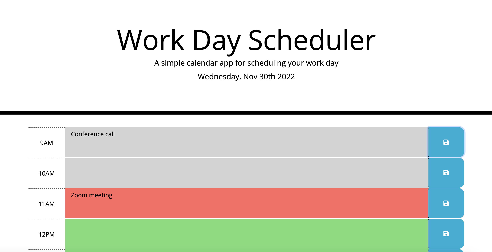
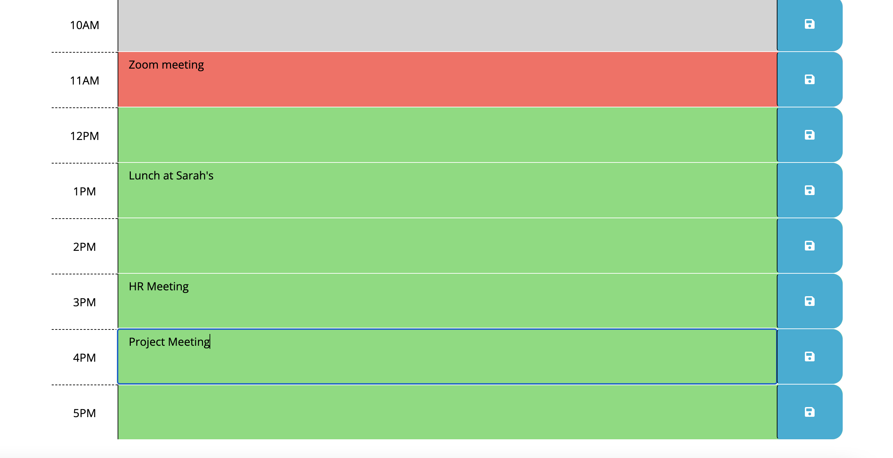

# Work Day Scheduler

## Description
A simple calendar application that allows a user to save events for each hour of the day. This app will run in the browser and feature dynamically updated HTML and CSS powered by jQuery.

## Table of Contents
* [Usage](#usage)
* [Mock-Up](#mock-up)
* [Screenshots](#screenshots)
* [Links](#links)
* [Contact](#contact)

## Usage

This Work Day Scheduler allows you to schedule events between the hours of 9AM and 5PM, and shows the current date at the top of the page. 

It will display each hour row in different colors according to the time of day. The current or present hour will display in the color red, green for the future hours, and gray for the past hours.

Each hour block has an input field where the user can insert events, and save to their local storage by clicking the save button.

[Back to top](#work-day-scheduler)

## Mock-Up

The following animation demonstrates the application's intended appearance and functionality:

[Back to top](#work-day-scheduler)

## Screenshots

The following screenshots demonstrate my application's appearance and functionality:

[Back to top](#work-day-scheduler)

## Links
- [Live Deployed Application](https://kdrummond528.github.io/Work-Day-Scheduler/)

[Back to top](#work-day-scheduler)

## Contact
- Feel free to [email](mailto:k.drummond528@gmail.com) me if you have any questions or comments.

- Check out my [GitHub](https://github.com/kdrummond528).

- Connect with me on [LinkedIn](https://www.linkedin.com/in/karinadrummond).

- View my [portfolio](https://kdrummond528.github.io/Personal-Portfolio/).

[Back to top](#work-day-scheduler)
